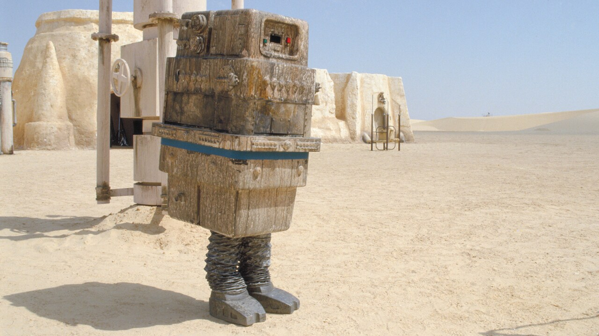

# GONK | Aurebesh Transliterator

Welcome to Aurebesh Transliterator! This web application allows you to transliterate English text into Aurebesh, using the UI style from Star Wars Battlefront II (2017)

## Features

- **English to Aurebesh Transliteration**: Convert your English text into Aurebesh, the fictional alphabet from the Star Wars universe.
- **Aurebesh to English Transliteration**: Convert your Aurebesh text into English.
- **Star Wars Battlefront II UI Style**: Enjoy the immersive experience of using the same style as the in-game UI from Star Wars Battlefront II (2017).
- **Easy to Use**: Simply type or paste your English text into the input field, and watch it transform into Aurebesh instantly!

## How to Use

1. Access the Aurebesh Transliterator website.
2. Type or paste your English text into the input field.
3. Your text will be automatically transliterated into Aurebesh using the Star Wars Battlefront II UI style.
   
## Development

This project is built using HTML, CSS, and JavaScript. It utilizes the Aurebesh font and styling inspired by the UI from Star Wars Battlefront II (2017).

### Installation

To run this project locally, follow these steps:

1. Clone this repository or Download the Source Code from "Releases" to your local machine.
2. Navigate to the project directory.
3. Open `aurebesh.html` in your preferred web browser.
